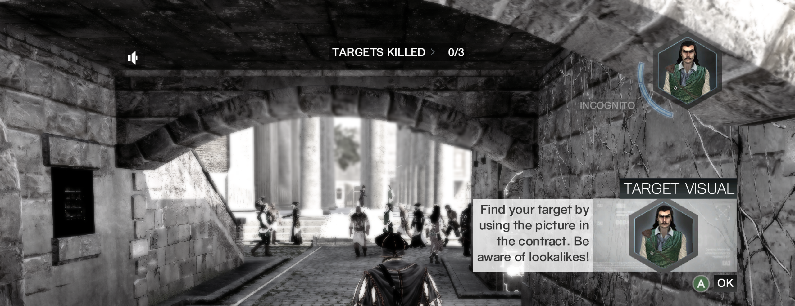
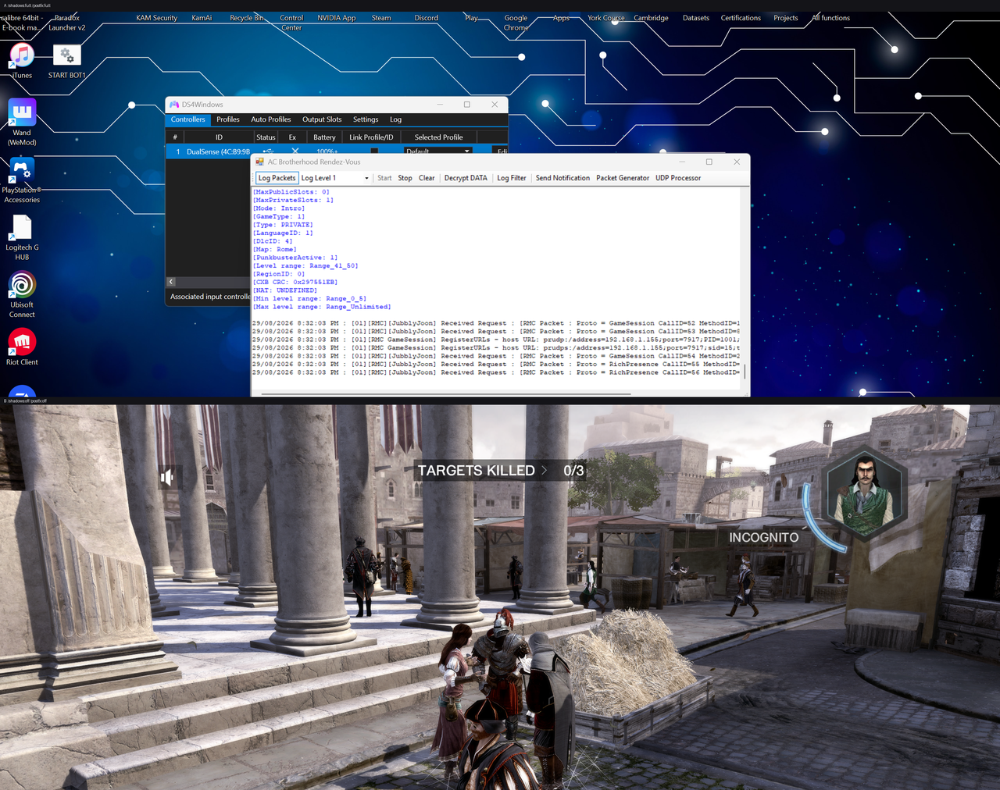
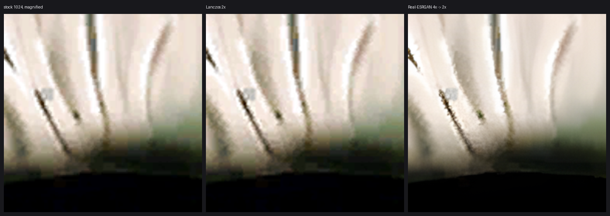
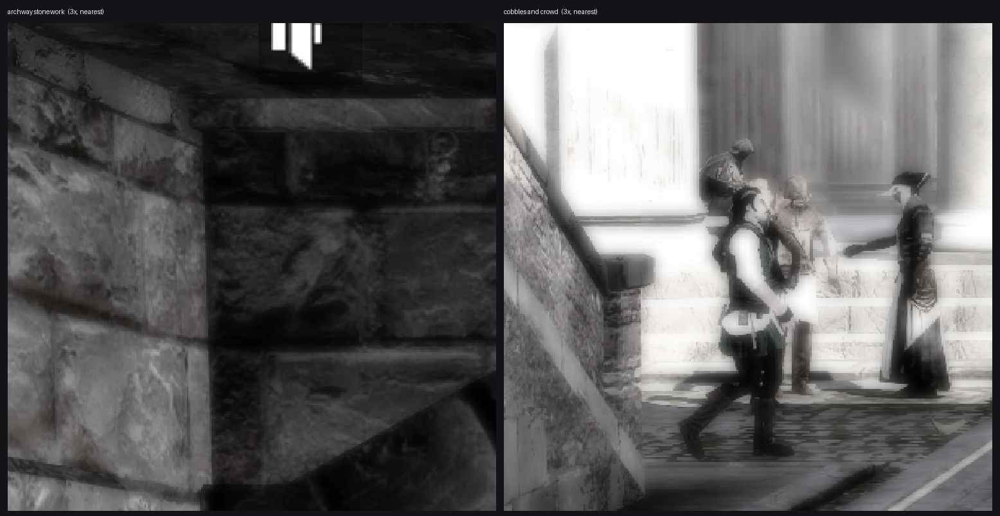

# AC Brotherhood — Private Multiplayer Server + Launcher

A private matchmaking server for **Assassin's Creed: Brotherhood** multiplayer, whose official Ubisoft services were decommissioned on 1 October 2022 — plus a launcher that adds display and quality options the game itself does not expose.

This is a fork of [michal-kapala/acb-rdv](https://github.com/michal-kapala/acb-rdv), which does the hard part: reimplementing Ubisoft's Quazal **Rendez-Vous** backend.

> **You need your own legal copy of the game.** No game *files* are redistributed
> here — every tool reads and writes your own installation. The screenshots below
> are illustrative only.

---

## What this actually is

Brotherhood's multiplayer splits in two:

| Layer | Who handles it |
|---|---|
| Login, lobbies, matchmaking, friends | **This server** (Quazal Rendez-Vous) |
| The match itself | **Peer-to-peer between players** |



*The tutorial session in Rome, running on rebuilt forges: all 69 character
textures and all 770 environment textures upscaled 2x through Real-ESRGAN.*

The server introduces players to each other and then steps out. It never sees the gameplay. That means you do not need a powerful host — but it also means players must be able to reach each other directly (see *Networking*).

---

## Requirements

- Assassin's Creed: Brotherhood (PC)
- Windows, .NET Framework **4.8 runtime** (Windows 10/11 ships with it)
- **.NET Framework 4.8 Developer Pack** — build only ([download](https://aka.ms/msbuild/developerpacks))
- Visual Studio 2022, or Build Tools (MSBuild)
- [SQLite CLI](https://sqlite.org/download.html) on `PATH`

---

## Setup

### 1. Build

```
MSBuild "ACB RDV\ACB RDV.csproj" -p:Configuration=Release -p:Platform=x86
```

> Upstream gitignores `*.config`, so `packages.config` is not committed and NuGet restore cannot run. Every required DLL already ships in `ACB RDV/bin/x86/Release/` — recreate `packages/` from those, plus a stub for `Stub.System.Data.SQLite.Core.NetFramework.targets` (its only job is copying a native DLL the repo already includes).

### 2. Database

```
sqlite3 "ACB RDV\bin\x86\Release\database.sqlite" < db_init.sql
sqlite3 "ACB RDV\bin\x86\Release\database.sqlite" < tools\dlc-privileges.sql
```

Then **change the default password** — `Player`/`pass` is published in this repo:

```
powershell -File tools\rename-player.ps1 -List
```

### 3. Point the server at an address

`App.config` is per-user and not tracked. Copy the template:

```
copy "ACB RDV\App.config.example" "ACB RDV\App.config"
```

Then set `SecureServerAddress` to the IP players will reach you on:

```xml
<appSettings>
  <add key="SecureServerAddress" value="YOUR.IP.HERE" />
</appSettings>
```

This value is **both** the bind address and what clients are told to connect to, so it must be a real adapter on the host *and* reachable by every player. Rebuild after changing it.

### 4. Each client

Add to `C:\Windows\System32\drivers\etc\hosts` (needs admin):

```
YOUR.IP.HERE onlineconfigservice.ubi.com
```

### 5. Play

```
powershell -STA -File tools\acb-settings.ps1
```

> `-STA` is required. In MTA mode `ShowDialog()` returns immediately and no window appears.

---

## Playing alone

A private lobby refuses to start below a minimum and greys out LAUNCH with
*"There are not enough members in your group to play this mode in a PRIVATE
session."* Each mode carries its own minimum:

| Mode | Private minimum |
|---|---|
| MANHUNT, CHESTCAPTURE, TEAMVIP | 2 |
| ALLIANCE, ADVALLIANCE | 3 |
| WANTED, ASSASSINATE, advwanted | 4 |

**So a two-player private lobby needs no modification at all** — pick one of the
first three modes. For a genuinely solo match:

```
python tools\solo-launch-patch.py --apply
python tools\solo-launch-patch.py --status
python tools\solo-launch-patch.py --revert
```

The client matches gamesettings XML attributes against a table of names
compiled into `ACBMP.exe`. This renames `PrivateMinPlayers` there, so the lookup
never matches and the field keeps its constructor default. One byte, same
length, reversible, and the `.cxb` is not touched.

**Only the machine playing alone needs it.** Friends run a stock game; nothing
is redistributed. Steam's *Verify integrity of game files* restores the original
and silently switches solo launch back off — `--status` will tell you.

The tool refuses to patch blind: it stops if the string is missing, occurs more
than once, or is not NUL-terminated where expected, so a game update cannot turn
it into a silent corruption.

### Why not just edit the settings file

`PrivateMinPlayers` lives in the server-authoritative `.cxb`, so editing it there
looks obviously right, and it was tried first and at length. **The client rejects
an edited settings file** and drops to *"Connection to Assassin's Creed:
Brotherhood server lost"* at the loading screen.

Not for want of care. The trailer turned out to be a **CRC32 over the whole file
with its own 40 bytes zeroed**, stored as ASCII decimal — `cxb-edit` now
recomputes it, and restamping reproduces the shipped file byte for byte. An
unchanged extract/replace round-trip is byte-identical, so the compressor is
bit-compatible and section sizes update correctly. A single mode changed by one
byte with a valid checksum is *still* refused. Something beyond the checksum is
validated, and it has not been identified.

---

## Networking

Because the server binds the literal IP it advertises, **port forwarding a public IP does not work** — you cannot bind an address that lives on your router.

Use a virtual LAN instead. Every player installs [Radmin VPN](https://www.radmin-vpn.com/) (or ZeroTier / Tailscale), joins one network, and the host uses their `26.x.x.x` address as `SecureServerAddress`. The same virtual LAN also carries the peer-to-peer gameplay traffic, so nobody needs router configuration.

Ports: **TCP 80**, **UDP 21030–21031**. Scope firewall rules to the virtual LAN subnet only — never expose them to the internet.

---

## Tools

| Script | Purpose |
|---|---|
| `tools/acb-settings.ps1` | Launcher GUI — display mode, quality, account |
| `tools/acb-launcher.ps1` | CLI launcher; starts the server, applies window style and match rules |
| `tools/cxb-edit` | Read and write sections of the served `gamesettings` `.cxb` |
| `tools/ability_rules.py` | Retune ability cooldowns, durations, radii and speeds |
| `tools/solo-launch-patch.py` | Let a private lobby start with one player (one byte in `ACBMP.exe`) |
| `tools/lobby_rules.py` | Read/write the per-mode player-count gates in the `.cxb` |
| `tools/skills-editor.ps1` | Edit and unlock every ability from one screen |
| `tools/anvil-reflect` | Dump AnvilToolkit signatures when a write path is needed |
| `tools/add-player.ps1` | Create an account with a random password |
| `tools/rename-player.ps1` | Rename an account (this is the in-game name) |
| `tools/dlc-privileges.sql` | DLC entitlements + locale fix |
| `tools/cxb_tool.py` | Parse the `gamesettings` `.cxb` container |
| `tools/glyph-swap.ps1` | Switch the controller diagram between Xbox and PlayStation |
| `tools/acb-graphics.ps1` | Read and raise the multiplayer graphics settings |
| `tools/texture-upscale/` | AI-upscale textures 2x: BC codec, header rewrite, batch |
| `tools/forge-extract/` | Extract a `.forge` into `.data` containers, no GUI |
| `tools/recolour_texture.py` | Recolour a persona or any BC1/BC2 texture, reversibly |
| `tools/recolour-persona.ps1` | Recolour a whole persona at once, with matching tone |
| `tools/bot_vm.py` | Behaviour VM for bot players — tiers, patrols, pursuit |
| `tools/warm-body.ps1` | Put bot players in a match so challenges can score |
| `tools/anvil-unpack/` | Unpack `.data` containers in batch, no GUI |
| `tools/anvil-inflate/` | Inflate a container chunk — archives, `OPTIONS`, `.SAV` |
| `tools/anvil-repack/` | Repack `.data` containers and the `.forge`, no GUI |

### Display modes

The game has no windowed or borderless option, and its options menu cannot be extended — it is Scaleform UI compiled into the executable. The launcher applies the window style via Win32 after launch instead:

```
powershell -File tools\acb-launcher.ps1 -Display Borderless -Quality High
powershell -File tools\acb-launcher.ps1 -Display Windowed -Width 1600 -Height 900
```

### Match rules

Ability cooldowns, durations, radii and speeds are **served by the host**.
QuazalWV's `PersistentStoreService` hands `gamesettings_c1380_d873_s6285.cxb`
to every client on connect, so changing it on the server changes the rules for
everyone who joins - nobody else installs anything.

```
powershell -File toolscb-launcher.ps1 -RulesOnly -CooldownScale 0.5
powershell -File toolscb-launcher.ps1 -RulesOnly -AbilityRule AbilitySmokeBomb:Radius=8.0
powershell -File toolscb-launcher.ps1 -RulesOnly -ResetRules
```

`-RulesOnly` applies rules without launching, so they can be changed between
matches. Rules are always rebuilt from a pristine backup rather than the
current file, so `-CooldownScale 0.5` twice still means half, not a quarter.

`python tools/ability_rules.py --xml <file> --show` lists every tunable value.
See [re/ABILITIES.md](re/ABILITIES.md) for the container format.

`-Quality High` is a preset for `/shadows:full /postfx:full /msaa:8x` plus full
mip chains. Every switch is also settable on its own, and the settings GUI drives
them individually:

```
powershell -File tools\acb-launcher.ps1 -AmbientOcclusion on -FullMips on -Shadows full
```

| control | switch | measured |
|---|---|---|
| Shadows | `/shadows:` | **visible effect**, see below |
| Post-processing | `/postfx:` | **visible effect**, see below |
| Anti-aliasing | `/msaa:` | — |
| Full mip chains | `/skipmips:off` + character + environment | +108.6 MB |
| Atlas mipmaps | `/generateatlasmipmaps:on` | +111.5 MB |
| Ambient occlusion | `/computeao:on /skipao:off` | -110.5 MB |
| Draw distance | `/fardist:` | -60.9 MB at 10000 |

`/shadows` and `/postfx` **do something**, established by comparing two frames in
the world with every other switch held identical:



| | luminance std |
|---|---|
| `/shadows:full /postfx:full` | **106** |
| `/shadows:off /postfx:off` | **63** |

A contrast collapse of that size is what losing shadow darkening and
post-process tonemapping looks like. Before this they had shipped in
`-Quality High` purely on the assumption that they worked.

**The confound, stated rather than buried:** the two frames are from different
camera positions, so a per-pixel diff between them measures where the player was
standing. The luminance statistic is robust to that in a way a pixel diff is not,
but this is evidence rather than proof.

Three earlier attempts at this produced nothing and one produced a convincing
lie. A fixed dwell captured the *main menu* in both arms — 357 MB against a
350—400 MB menu and a 700—900 MB world — and reported an 84% pixel difference
that was entirely the menu's animated background. The harness now triggers on the
world being resident and marks a run void if it never gets there. The game does
not enter the tutorial unattended, so this needs someone playing.

**Memory could not attribute a per-map cost** and no figure is quoted for one.
Across three runs, peak working set tracked how far into the session the player
got more strongly than which textures were loaded — a vanilla-texture run peaked
*higher* than an upscaled one. Picking the pair that fit the story would have
given a clean 88 MB. The claim that does hold is the whole-roster one above:
698 MB stock against 904 MB fully upscaled.

The last four have **no in-game equivalent at all** — they are what the launcher
genuinely adds over the options menu. The figures are peak working set against an
invented control switch on an idle machine, 0.2 MB noise floor. They prove the
switches do something; **nobody has compared frames**, so none is a verified image
improvement. They were also measured at the main menu, where far less is
resident, so treat them as lower bounds on in-game cost.

`TextureQuality`, `EnvironmentQuality`, `CharacterQuality`, `ReflectionQuality`,
`VSync` and the resolution have **no switch** and exist only as INI keys. The GUI
shows them as read-only status, because they are all already at their ceilings
and the game rewrites the file from its own state.

Two of those used to be wrong. The MSAA switch has its own value vocabulary —
`none | 2x | 4x | 6x | 8x`, matching the `Multisample_8x`..`Multisample_None`
enum — so the old `/msaa:full` was not a value the game accepts and did nothing.
And `/lightmode:full` is no longer passed at all: `DisplayOptions::LightingMode`
enumerates `NormalLighting | DefaultLight | FullBright`, so `full` most likely
selects the flat debug view, which takes lighting *away*.

### Graphics quality — three INI files, and an open question

There are **three** INIs, not two, and until today the third was missed entirely:

```
%USERPROFILE%\Saved Games\Assassin's Creed Brotherhood\
    ACBrotherhood.ini      bare key names — ShadowQuality=4, PostFX=1
    ACBrotherhoodMP.ini    key bindings only
<game>\
    ACBrotherhoodMP.ini    Options* key names — OptionsShadowQuality=2
```

`ACBMP.exe` names **both** graphics files as wide strings, so the multiplayer
binary touches both and the third file is certainly real. **Which one actually
drives multiplayer rendering is unresolved**, and the two candidates predict
opposite things:

- the `Options*` file ships every quality key at **2**, the top of the
  three-step in-game menu;
- the bare-name file already ships **above** that — 4, 3 and 4 — so on that
  reading multiplayer is running high already.

Do not assume the convention splits by executable: `ACBSP.exe` contains the same
`Options*` names, and both binaries carry the bare names too. The bare list also
holds `SupportedMSAAModes` and `GraphicsModified`, which cannot be INI keys at
all, so some of those names are runtime properties rather than file keys.

#### Answered — three times, and the first two answers were wrong

Measured: `ACBMP.exe` rewrites `Saved Games\ACBrotherhood.ini` and leaves **both**
MP-named files untouched, so the game-directory file — real, and genuinely
missed until now — is never read. Every key was then armed at 9 and the game
launched. It wrote back:

| key | ceiling |
|---|---|
| `TextureQuality` | **2** |
| `EnvironmentQuality` | 5 |
| `ShadowQuality` | 4 |
| `ReflectionQuality` | 3 |
| `CharacterQuality` | 4 |
| `MultiSampleType` | 8 |
| `PostFX` | 1 |

**Every key clamped to the value it already held**, which looked conclusive and
was not. Every value armed in that run was ABOVE the ceiling, and clamping an
out-of-range value is indistinguishable from ignoring the file entirely. A second
run armed `ShadowQuality=1` — still not a valid test, because nobody had checked
the menu's *minimum*, so that was out of range too, and its rejection got written
up here as proof the INI was an output. It is not.

**The INI is read.** Arming `ShadowQuality=3`, a value genuinely in range, gives a
menu reading of 4 and the value survives in the file across a launch. What
actually happens is:

| | |
|---|---|
| at startup | the game **reads and applies** the file, including out-of-range values — armed 3 and 4 displayed as menu 4 and 5 |
| on write | it **clamps** to the menu maximum — Environment 6→5, Texture 4→2, Character 5→4 |

So the ceiling can be exceeded **per session but not persistently**, and the
persistence problem is solved by writing the value immediately before launch,
which the launcher is positioned to do.

**What is still unverified is whether exceeding it renders anything differently.**
Displaying a number and sampling at it are separate claims. Until a same-scene
comparison at two settings says otherwise, "the menu was hiding steps" is a
statement about a menu, not about pixels.

`ReflectionQuality` and `PostFX` are **not numeric scales** — the menu shows them
as `HIGH` and `ON`. Their "ceilings" of 3 and 1 are enum indices, so pushing them
past maximum is not a meaningful experiment the way it is for the others.

**`RefreshRate=240` is honoured**, and this one is settled: the game's own options
screen reports `2560x1600, 240Hz`. That is the engine stating its mode back,
which is stronger than the file agreeing with itself. An earlier note here said
it was merely re-emitted and unproven; that is superseded.

Two method notes for anyone scripting this. The game writes the file **early,
while the process is alive**, not on exit — so the test is launch, wait, read,
with no menu exit needed. And a bare `ACBMP.exe` launch exits immediately with
code 41 and writes nothing: it needs `/onlineUser` and `/onlinePassword` to get
far enough to write its config, and without them a run looks exactly like "the
keys are inert".

```
powershell -File tools\acb-graphics.ps1 -Status
powershell -File tools\acb-graphics.ps1 -Set Max     # put every key back at its ceiling
powershell -File tools\acb-graphics.ps1 -Set Beyond  # the experiment above, reproducible
powershell -File tools\acb-graphics.ps1 -Verify      # after one launch
powershell -File tools\acb-graphics.ps1 -Restore
```

`-Set Max` is the one worth running: it puts every key back at its measured
ceiling, which is useful after the in-game menu has lowered something. `-Set
Beyond` is kept so the closed experiment can be reproduced, not because it will
find anything.

The game writes this INI **early, with the process alive**, so the test is
launch, wait about fifteen seconds, read. Do not open the in-game graphics menu
in between — saving it writes the menu's own values back over yours. The script
refuses to write while `ACBMP.exe` is running, edits only the `[Graphics]`
section so the input profiles in that file survive untouched, and keeps a backup.

`-Verify` checks **whether the game rewrote the file** before it believes any
value, because a value comparison alone cannot tell a pass from a non-run:

| what `-Verify` sees | what it means |
|---|---|
| file unchanged | the run says **nothing** — the game never started, or does not write that file at all |
| rewritten, key gone | **inert** — the game rewrote the file and did not re-emit that key |
| rewritten, value back to 2 | **read and clamped** |
| rewritten, value still 5 | **read and honoured** — real headroom the menu never offers |

It baselines all three INIs, not just the one it edits, so a run that rewrites a
file nobody was watching is not mistaken for a run that rewrote nothing. On a
no-run it keeps the pending state so the test still stands.

It targets `<game>\ACBrotherhoodMP.ini`. If the open question above resolves the
other way, point it at the other file with `-GamePath`, or the tool will be
editing something the game ignores.

`-Set Beyond` also sets `MultiSampleType=8` and raises `RefreshRate` to the
display's actual rate; neither is a quality-menu entry, so neither is subject to
whatever the menu clamps.

### Controller glyphs — Xbox or PlayStation

Brotherhood ships **both** glyph sets on PC, but the executable only ever
requests the Xbox one, so `Binding_PS3` sits unused. `glyph-swap.ps1` puts
whichever artwork you want into the slot the game asks for, and switches back:

```
powershell -File tools\glyph-swap.ps1 -Status
powershell -File tools\glyph-swap.ps1 -Set PlayStation
powershell -File tools\glyph-swap.ps1 -Set Xbox
```

**Prerequisite** — unpack these in AnvilToolkit first, in order:
`multi\DataPC_extra.forge`, then `1000_-_Binding_360_DiffuseMapDesc.data`,
then `1001_-_Binding_PS3_DiffuseMapDesc.data`.

Afterwards repack in AnvilToolkit, inner first (`1000_-_...data`, then
`DataPC_extra.forge`). **Close the game before repacking** — it holds the forge
open and Repack fails silently, with no error and no log line.

The script keeps a pristine copy of the stock Xbox texture on first run, so the
switch is reversible. No game assets are redistributed; both textures are read
from your own installation.

**Why it needs a script rather than a file copy:** each TextureMap carries a
4-byte File ID at offset 2. Copying the PS3 texture brings its own ID
(`0x1D3FE379`) with it, the game cannot bind the texture, and the diagram
renders as a flat grey block. The script always rewrites the ID to the 360's
value (`0x1D3FE3AF`).

**Scope:** this changes the CONTROLLER LAYOUT diagram. Footer prompt icons are
drawn from `PC_btn_circle`, a PC-only texture with no PlayStation counterpart,
with the letter drawn over it as text — so those stay as they are.

### Recolouring personas

`recolour_texture.py` recolours a character by transforming only the two RGB565
**endpoints** of each compressed block and leaving the per-pixel index bits
alone. Every pixel changes colour while all detail, shading, folds and stitching
survive exactly — the block compression does the interpolation for you. There is
no decode, no re-encode and no image editor involved.

```
python tools/recolour_texture.py --texture "<path>\1_-_BarberUp_DiffuseMap.TextureMap" \
    --scheme gold_black --keep G2,H2,H3,H4 \
    --backup "<game>\multi\_persona_backup\BarberUp_ORIGINAL.TextureMap" \
    --preview out.png
```

| Option | Purpose |
|---|---|
| `--scheme` | Repaint: `gold_black`, `crimson_black`, `emerald_black`, `sapphire_black`, `bone_white`, `desaturate`. Enhance: `vibrant`, `vibrant_soft`, `vibrant_strong` |
| `--strength` | `0.0`–`1.0`, blend towards the scheme |
| `--grid` | Render a labelled `A1..H8` overlay of the atlas |
| `--keep` | Hold cells (`G2,H2`) or rects (`x0:y0:x1:y1`) at original colours |
| `--only` | Recolour **only** those cells — the inverse of `--keep` |
| `--part` | Recolour one named part from a region map |
| `--auto-map` | Analyse the atlas and write a starter region map |
| `--mask-coherence` | How much of the 3×3 around a block must agree before it is held back |
| `--max-saturation` | Only recolour blocks duller than N, so leather, wood and metal keep their own colour |
| `--strong-saturation` | Blocks this colourful are protected whatever their hue, so dyed cloth survives |
| `--levels` | Force one tonal range across every texture of an outfit so the halves match |
| `--dry-run` | Preview only, write nothing |
| `--restore` | Put the backup back |

Character textures are **atlases** — clothing, straps, boots and props share one
sheet. Use `--grid` to see the layout, then `--keep` to protect anything that
should stay its original colour.

`--max-saturation` is usually the better tool for that. Cloth is close to grey
while leather, wood and metal are strongly coloured, so a single threshold
(around `25`) recolours the garment and leaves its fittings alone — no region
picking, and it transfers to any persona.

Protection is **hue-aware**, which matters more than the threshold. On the
Barber, 6,549 protected blocks were warm (leather, wood, skin) and 771 were cool
blue-greys — and both sat in the same 30–44 saturation band, so no threshold
could separate them. Requiring protected blocks to be *warm* recolours the greys
and keeps the leather. `--strong-saturation` then rescues strongly dyed cloth of
any hue, so a green sash survives on warmth grounds it would otherwise fail.

#### Region maps — colouring parts individually

Saturation alone cannot tell a belt from a boot. A **region map** names parts of
an outfit so they can be coloured separately, and remembers them between
sessions:

```
python tools/recolour_texture.py --texture "<tex>" --regions tools/persona-regions.json     --persona Barber --auto-map
python tools/recolour_texture.py --texture "<tex>" --regions tools/persona-regions.json     --persona Barber --part fittings --scheme crimson_black
```

`--auto-map` classifies every grid cell by the **fraction** of blocks in it that
are colourful — not the mean, which averages a mixed cell back down to "cloth"
and was the first thing that went wrong here. It writes `cloth` and `fittings`
plus a `measured` table of per-cell colourfulness and brightness. Rename and
split those into real parts (`tunic`, `belt`, `boots`) as you identify them,
then colour each with its own scheme.

`tools/persona-regions.json` ships with the Barber already mapped.

To do a whole character at once, use the wrapper — it finds every diffuse
texture the persona owns, measures the tonal range **once** and forces it on all
of them, so the halves match instead of drifting apart:

```
powershell -File tools\recolour-persona.ps1 -Persona Barber -Scheme gold_black
powershell -File tools\recolour-persona.ps1 -Persona Barber -Status
powershell -File tools\recolour-persona.ps1 -Persona Barber -Restore
```

It reports which of the persona's resources still need unpacking in AnvilToolkit.
Head resources are skipped unless you pass `-IncludeHead`, since a recoloured
face reads as a rendering bug rather than a costume.

Afterwards repack in AnvilToolkit, inner `.data` first, then the `.forge`, with
the game closed.

#### Unpacking without the GUI

`tools/anvil-unpack` drives AnvilToolkit's own code through reflection, so
containers can be unpacked in batch instead of one click at a time. Needs the
[.NET 9 SDK](https://dotnet.microsoft.com/download/dotnet/9.0).

```
dotnet run --project tools/anvil-unpack -- --all "<game>\multi\Extracted\DataPC.forge" --filter _Set
```

64 persona containers in one pass. The container codec is LZO1X with the
algorithm and version carried in each block header — but rather than
reimplement it (an attempt that failed on the details), this calls
`DataFile.Deserialize` directly and gets exactly what the GUI produces.

`tools/anvil-repack` is the write half:

```
dotnet run --project tools/anvil-repack -- --data-all "<...>\DataPC.forge" --only-modified
dotnet run --project tools/anvil-repack -- --forge  "<...>\multi\DataPC.forge"
```

**Inner `.data` first, then the `.forge`** — the forge gathers the containers as
they are on disk, so doing it first silently repacks the originals.

Both paths write to a temp file and swap only on success, and both verify the
file actually changed. A repack against a forge held open by the game or
AnvilToolkit fails *silently* — no error, no log line — so "no exception" is not
evidence of success and is not treated as such. The forge keeps the previous
version beside it as `.bak`; delete it once you are satisfied.

**Texture format.** A `.TextureMap` is a 90-byte header, then raw BC blocks for
every mip level largest-first, then a 61-byte trailer. Because that trailer is
always 61 bytes, `filesize - payloadsize` always equals `151`, which looks
exactly like a header length and is not one — reading from there shifts every
block by 61 bytes. See [re/FINDINGS.md](re/FINDINGS.md) for the full layout and
the two bugs worth not repeating.

---

## What changed graphically

Everything below is offline work on your own installation. Nothing costs frame
time, and every change is reversible from a `.bak`.

| change | what it does | state |
|---|---|---|
| **1,133 textures at 2x** | Every diffuse texture in the multiplayer game through Real-ESRGAN — 69 characters, 770 environment across twelve maps, 294 DLC skins | done, verified in game |
| **16x anisotropic filtering** | The game does no AF at all — zero `Anisotropic` keys in either binary. Ground and walls at a shallow angle went from smeared to legible | done, driver-side |
| **Full mip chains** | `/skipmips:off` and friends. +108.6 MB resident | in the launcher |
| **Atlas mipmaps** | `/generateatlasmipmaps:on`. +111.5 MB, possibly the same effect | in the launcher |
| **Ambient occlusion** | `/computeao:on /skipao:off` — contact shadowing, no in-game equivalent | in the launcher |
| **Draw distance** | `/fardist:` — no in-game equivalent | in the launcher |
| **Shadows / post-processing** | `/shadows:full /postfx:full`. Luminance std 106 against 63 with them off | measured, camera-confounded |
| **8x MSAA, 240 Hz, all quality maxima** | Confirmed from the game's own options screen | already at ceiling |
| **Windowed / borderless** | The game has no such option; applied via Win32 after launch | done |

### Switching between vanilla and upscaled

There is no honest before/after without standing still and swapping. Comparing
two screenshots taken at different moments compares camera positions — a
"sharpness" number computed that way measures where you were standing, which is
exactly how one comparison here briefly "proved" the upscale made things blurrier.

```
powershell -File tools\texture-toggle.ps1 -Capture Upscaled
powershell -File tools\texture-toggle.ps1 -Capture Vanilla
powershell -File tools\texture-toggle.ps1 -Mode Vanilla
```

Two complete sets of forges are kept side by side and switching copies one over
the live files — **seconds**, not the hours a rebuild takes, at a cost of about
3 GB. The launcher exposes the same thing as a **Texture set** dropdown, applied
before launch. It cannot be an in-game button: the game reads its forges at
startup.

`-Capture Vanilla` refuses any forge whose `.bak` is not byte-for-byte the size
Steam ships, because an intermediate backup is indistinguishable from a pristine
one by name alone. If it skips some, verify the game files through Steam and
re-capture.

**Four of those controls have no in-game equivalent whatsoever** — full mip
chains, atlas mipmaps, ambient occlusion and draw distance. They are what the
launcher genuinely adds over the options menu.

**What did NOT change, deliberately:** normal and specular maps are untouched. A
model trained on photographs invents *geometry* in a normal map rather than
detail, and it reads as wrong under every light. Nothing about gameplay, physics
or abilities is modified.

**What is honestly unproven:** that a raised `TextureQuality` renders any
differently, and that the shadows/postfx difference above is not partly camera
position. Both are recorded as unverified rather than quietly claimed.

## Characters stay VANILLA: the repack is lossy for everything

**The persona archives cannot be safely rebuilt with this tooling, so they are
left untouched.** This is a negative result and it is load-bearing - without it
somebody will try the obvious thing again and ship broken characters.

The symptom was Dama Rossa rendering with no arms beyond ~10 m and as a bare
torso up close. Her models were byte-identical to vanilla at the time, so it was
not the models - an upscaled texture failed to load and the engine culled the
meshes that used it.

**The proof that the repack itself is at fault:**

| Container | Vanilla | After repack | Kept | Did we modify it? |
|---|---|---|---|---|
| `LocalizationPackage_English` | 317,792 | 305,994 | 96.3% | **no - it has no textures** |
| `LocalizationPackage_Japanese` | 273,960 | 263,491 | 96.2% | **no** |
| `AC2MP_ID31_Top` | 2,600,194 | 2,544,283 | 97.8% | textures only |
| `AC2MP_ID32_MainTemplate_Player` | 3,833,796 | 849,778 | **22%** | textures only |
| `DLCPackageDescriptor` | 113,066 | 852 | **1%** | no |

Containers we never touched still lose data. AnvilToolkit reads every resource
and writes back less than it read - typically 2-4%, and up to 78% on
model-heavy containers - with no error. Our upscaling does not cause it; any
repack at all does.

That also explains why the damage hid for so long: a `MainTemplate` holds the
character's textures AND its model, so upscaled textures grew those containers
enough to mask the model loss. Only the containers that shrank ON BALANCE ever
looked wrong.

`anvil-repack` refuses a repack that comes out below 95% of the original, which
catches the catastrophic cases. It CANNOT make this safe - a 3% loss passes, and
a container can grow while still having lost its model.

**What is done instead:** the 13 map forges keep their upscale and look correct;
the persona archives stay vanilla. Characters are at stock resolution with
correct models, which is the right side of that trade. Improving character
fidelity needs a repacker that round-trips faithfully, which AnvilToolkit is
not.

---

## Character models: why personas are upscaled but not repacked whole

**Every `MainTemplate` container in the persona archives is lossy to repack.**
AnvilToolkit reads all of a container's resources and writes back a fraction of
the data, with no error:

| Container | Vanilla | Repacked | Kept |
|---|---|---|---|
| `ID28_MainTemplate_Player` | 4,070,556 | 740,596 | 18% |
| `ID32_MainTemplate_Player` | 3,833,796 | 849,778 | 22% |
| `ID25_MainTemplate_Player` | 7,618,081 | 2,551,633 | 33% |
| `ID14_MainTemplate_Player` | 5,175,816 | 2,353,863 | 45% |
| `DLCPackageDescriptor` | 113,066 | 852 | **1%** |

This shipped once. The symptom was Dama Rossa (`ID32`) rendering as a floating
torso, and the first diagnosis was that only ID32 and ID31 were affected because
they were the only two that visibly SHRANK. That was wrong: a MainTemplate holds
the character's textures as well as its model, so on the upscaled run the larger
textures grew those containers enough to **mask** the model data being lost.
Every persona was losing model data; ID32 simply lost more than its textures
gained.

**How it is handled.** `anvil-repack` refuses any repack that comes out below 95%
of the original and keeps the original. The persona run then produces:

- character models **byte-identical to vanilla** - verified, 0 of 14 altered
- 112 containers carrying upscaled textures
- 76 of 78 upscaled textures kept; the 2 inside refused containers stay vanilla

So personas get upscaled textures and intact models. The cost is small and the
alternative is broken characters.

**Running it:**

```
python tools	exture-upscaleatch.py --prefix DataPC_skins_ --min-width 128
```

`--prefix` is required - the default prefixes cover only the map forges, and
`--only` is applied AFTER that filter, so `--only skins` silently matches
nothing. `--min-width 128` skips the ten 4x4 and five 8x8 maps, which are lookup
data rather than surfaces.

**Also note:** 37 of 202 containers never unpack at all. They are hash-named
(`00000000610A41C8.data`) and are skipped, so they stay vanilla - a known limit,
not new damage.

---

## Graphics: the antialiasing trade-off

**We turn MSAA OFF on purpose, to get ambient occlusion instead.** That is a
deliberate choice and it is worth understanding before you undo it.

The engine's own lighting is maxed out and cannot go further:

| Setting | Value | Why it stops there |
|---|---|---|
| `ShadowQuality` | 4 | measured ceiling; the game rewrites anything higher back down |
| `EnvironmentQuality` | 5 | measured ceiling |
| `PostFX` | 1 | an on/off enum, not a scale |
| `/lightmode` | never passed | its "full" is `FullBright` - a debug view with lighting REMOVED |

So better shadows and lighting have to come from outside the engine, and for a
Direct3D 9 game that means [ReShade](https://reshade.me/) with
[MXAO](https://www.martysmods.com/mxao/) - real screen-space ambient occlusion
and contact shadows the 2010 renderer never drew.

**MXAO needs the depth buffer, and MSAA denies it.** With multisampling on, the
shader gets nothing and silently does nothing. You cannot have both.

| | MSAA 8x | MSAA off + ReShade |
|---|---|---|
| Edges | hardware-clean | SMAA - slightly softer |
| Ambient occlusion | none | full MXAO |
| Contact shadows | none | yes |
| Depth and grounding | flat | substantially better |

We take the second. Edge quality is a small loss at 2560x1600; grounded
characters and occluded corners are a large gain, and they help far more on a
game whose lighting model is fifteen years old. Set `MultiSampleType=0` in
`Saved Games\Assassin's Creed Brotherhood\ACBrotherhood.ini` and enable SMAA in
ReShade.

**Frame generation is available too, free.** The game is DX9, so DLSS is out -
it needs DX11/12/Vulkan plus motion vectors from the engine, none of which
exist here, and that is also why the NVIDIA App cannot see `ACBMP.exe` at all.
The way round it is two free layers: [DXVK](https://github.com/doitsujin/dxvk)
translates D3D9 to Vulkan (drop the **x32** `d3d9.dll` beside `ACBMP.exe` - the
game is 32-bit), and NVIDIA **Smooth Motion** does driver-level frame
generation on Vulkan for RTX 40/50 cards.

---

## AI texture upscaling

Every diffuse texture in the multiplayer game is upscaled 2x through
Real-ESRGAN and repacked. Offline, so it costs nothing at runtime, and permanent.

| set | textures | forges |
|---|---|---|
| Characters | 69 | `DataPC.forge` |
| Environment | 770 | twelve map forges |
| DLC skins | 294 | two skins forges |
| **total** | **1,133** | **fifteen** |

The DLC skins were nearly missed. Those archives use **hash-named containers**
(`51_-_00000000A69A71B2.data`) rather than descriptive ones, so
`anvil-unpack --filter DiffuseMap` matches nothing there and reports a clean zero
— the whole archive has to be unpacked and the TextureMaps inside still carry
real names. `batch.py --prefix DataPC_skins_` walks them.

```
python tools/texture-upscale/upscale.py --in X.TextureMap --out Y.TextureMap \
       --scale 2 --model <path>/RealESRGAN_x4plus.fp16.onnx
python tools/texture-upscale/batch.py --dry-run
python tools/texture-upscale/batch.py --prefix DataPC_skins_
```

Needs `numpy`, `pillow` and an onnxruntime. The ONNX weights are fetched
separately and are not in this repo.

**Install the GPU build.** `pip install onnxruntime-directml` uses any DX12 card
— AMD, NVIDIA or Intel — and is **25x faster**: a 1024 texture takes 2.4 s
against 60 s on the CPU, so the full 1,133-texture roster runs in about twenty
minutes rather than four hours. Do not install both `onnxruntime` and
`onnxruntime-directml`; they provide the same module and having both breaks it.



*The same patch of one persona texture at the same on-screen size: the stock
1024 map magnified as the game magnifies it, plain Lanczos, and Real-ESRGAN run
at 4x then downsampled to 2x. The AI pass puts back weave and stitching rather
than smoothing the interpolation.*



*In-game stonework and cobbles at 3x nearest-neighbour, so what you are looking
at is texels rather than a smoothing filter.*

**The codec is the part worth trusting.** `bc.py` decodes and encodes BC1, BC2
and BC3 in numpy, and its decoder is **byte-exact against Pillow's** on all four
format codes in the roster. That cross-check found two real bugs: BC2 and BC3
colour blocks always use the 4-colour interpretation regardless of endpoint
order, and repairing a degenerate block by nudging an endpoint silently flipped
punch-through blocks to opaque. Round-trip re-encode is 39—53 dB.

**The header rewrite is four fields and three trailer fields**, and nothing else —
width, height, mip count, payload size, then width, height and mip count in the
trailer. There is no per-mip offset table. `texmap.py` refuses to load anything
whose declared payload disagrees with its geometry, which is what caught the
cubemap and the uncompressed format.

Three things that will bite anyone extending this:

- **Mip count changes when you double.** 1024 has 11 levels, 2048 has 12, so the
  payload grows by *more* than 4x. Assuming 4x yields a file a third short that
  otherwise looks correct.
- **There is a cubemap.** `id20_cubemap_Map` is 6 faces, flagged by the texture
  type at header offset 26 (1 = flat, 2 = cube). A tool assuming one face writes
  a sixth of the data.
- **Format 0 is not block-compressed.** `AC2MP_Radar_2ndTarget_01` declares 8 mips
  of 128x128 at 87,380 bytes, which is exactly the *uncompressed* RGBA chain at 4
  bytes per texel. Read as BC nothing lines up.

**2x is the ceiling, and it is an address-space limit rather than a taste one.**
`ACBMP.exe` is a 32-bit `LARGE_ADDRESS_AWARE` PE, so 4 GB. Measured peak working
set in a live match:

| assets | peak |
|---|---|
| stock | 698 MB |
| upscaled characters only | 803 MB |
| everything upscaled | **904 MB** |

Each step adds about what the extra texture data should cost, which is what says
the larger mips are genuinely resident rather than discarded at load. At 4x the
textures alone would be over 3 GB and the process would not fit.

**Resident is not the same as sampled.** Nobody has yet held a camera still
across a forge swap and compared frames, so "the data is loaded" is proven and
"every pixel is sampled at the higher resolution" is not.

### Extracting a forge without the GUI

`anvil-unpack` handles `.data` containers and `anvil-repack` writes a `.forge`
back, but forge → `.data` was GUI-only, which blocked any automated pass over the
map archives. `ForgeFile.Deserialize` mirrors the `Serialize` the repack tool
already calls:

```
dotnet run --project tools/forge-extract -- "<game>\multi\DataPC_AC2MP_Siena.forge"
```

It **appends the forge's own name to the folder it is given**, so the tool passes
the parent. Handing it the full output path yields `Extracted\<name>\<name>\`, and
a caller checking one level up sees an empty directory and reports a successful
extraction as a failure.

Of Rome's 1756 containers only 68 are `DiffuseMap`; 1141 are `DataBlock_*` script
and mission data with no textures at all, so `anvil-unpack --filter DiffuseMap`
cuts the work by 25x.

## Bots

`bot_vm.py` is a behaviour runtime for bot *players*. Brotherhood's AI is
compiled into `ACBMP.exe` and matches are peer-to-peer, so nothing can be
injected — a bot is a client with its own account, driven by synthetic input.

That constraint is also a feature: a bot has no position feed and no entity
list, so it genuinely cannot cheat. It goes off the face and heading of what is
on screen, and nothing else.

Behaviour is a small instruction set, the way a mission script walks a character
to a location — `GOTO`, `WANDER`, `LOOK`, `OBSERVE`, `STALK`, `PURSUE`, `KILL`,
`BLEND`, `WAIT` — with a program per state. Perception returns contacts carrying
only bearing, apparent distance, facing and appearance match. Confidence builds
by watching, and each tier needs a different amount before committing:

| Tier | Kill it plays for | Commits at | Patience | Sprints | Blown cover |
|---|---|---|---|---|---|
| `incognito` | Incognito | 0.90 | 10 ticks | 0% | **0** |
| `silent` | Silent | 0.82 | 7 ticks | 8% | 5 |
| `discreet` | Discreet | 0.62 | 4 ticks | 34% | 53 |
| `brute` | Poor | 0.38 | 1 tick | 78% | 217 |

One profile per kill type, worst to best: **Poor < Discreet < Silent < Incognito**.
`assassin` and `hunter` still work as aliases for `silent` and `discreet`.

Measured over 60 runs of 120 ticks each, scored against **ground truth** the bot
cannot see:

| Tier | Kills | Mistakes | Accuracy |
|---|---|---|---|
| `incognito` | 9 | 21 | 30% |
| `silent` | 68 | 82 | 45% |
| `discreet` | 253 | 249 | 50% |
| `brute` | 596 | 1083 | 35% |

A random guess scores 33%.

**Read these honestly.** Two axes behave exactly as designed and are monotonic:
blown cover (0 / 5 / 53 / 217) and kill volume (9 / 68 / 253 / 596). Patience
buys stealth and costs opportunities, precisely as intended.

**Accuracy is not ordered, and the claim that patience buys accuracy does not
survive this measurement.** `discreet` (50%) beats `silent` (45%), and
`incognito` sits at 30% — below the random baseline — on only 9 kills across 60
runs, which is noise, not skill. A tier that commits that rarely cannot be
measured this way at all. Either its threshold needs lowering or the metric
needs far more runs; both are open. An earlier version of this table claimed a
clean ordering on a smaller sample, and that ordering did not hold up.

That baseline exists because the simulated crowd contains **doubles** —
civilians wearing the target's own persona, visually identical to it. That is
the game's central mechanic, and without it appearance alone identifies the
target and every tier scores 100%, which is exactly what the first version of
this simulator did.

With doubles present, appearance cannot discriminate and **behaviour has to**.
The only behavioural channel inside the face-and-direction constraint is
*facing*: civilians hold a heading, a player looks around. Reading that takes
repeated observation of **the same body**, which is what makes patience worth
something — and what makes the impatient tier wrong most of the time.

```
python tools/bot_vm.py --simulate --ticks 40 --seed 7
```

**Honest reading of those numbers.** The ordering is monotonic and matches the
design, and the behavioural metrics (sprint rate, tell rate, blown cover)
separate cleanly. The accuracy gap between `assassin` and `hunter` is only about
1.2 standard deviations, because the patient tier commits rarely and so has a
small sample — treat it as suggestive, not established. `brute` versus the
others is solid.

**Perception is still the blocker.** `ScreenPerception` returns nothing:
locating the compass and target indicator in screen space at a given resolution
and HUD scale has not been done. Everything above that boundary is tested; below
it, nothing is. A bot that hallucinates contacts is worse than one that stands
still, so it returns nothing rather than guessing.

### Getting a real bot client into a match — what actually works

A bot here is a real game client with its own account. Two things had to be
solved before one could reach a live match, and both are done:

**More than one client per Windows session.** `ACBMP.exe` holds a named
semaphore and a second instance exits cleanly after ~5s. `tools/multi-instance-patch.py`
flips the conditional. Raising the semaphore counts does nothing — the check is
on `ERROR_ALREADY_EXISTS` from the name, not on acquiring a slot.

**Invitations have to be stored.** `SendInvitation` used to write to the
database only when the invitee was OFFLINE, but `GetInvitationsReceived` reads
from the database — so an invited player who was online had nothing to accept.
Invites are now persisted whatever the connection state, and cleared on accept
and decline.

**INVITE MID-GAME, NOT FROM THE LOBBY.** This is the part that matters and it is
not obvious. A bot has no input, so every screen needing a button press is a wall:

| Route | What happens |
|---|---|
| Lobby invite | accept → lobby → ready → **loadout** → **character select** → stalls, and the match never starts |
| Mid-game invite | joins a running match, loadout and character **auto-assigned**, spawns into the world |

So: launch the match solo first (see [Playing alone](#playing-alone)), then invite
the bot from inside the match. Confirmed working — the bot loaded in and held a
slot in a live match. The one run that succeeded was a mid-game invite; every
lobby invite died on the loadout screen.

**Presence needs no input at all**, which is what ability challenges require.
Input is only needed to make a bot *move*, and that is a separate problem:
`warm-body.ps1` injects keyboard scancodes, which reach only the focused window,
so driving a bot would steal focus from the player. ViGEmBus is installed on this
machine, and a virtual gamepad is the likely way round it, since XInput is often
polled regardless of focus. Untested.

**Open question.** A bot left a live match after ~106s and ~126s in two runs, both
times shortly after being interacted with. Idle kick and interaction desync both
fit; they need different fixes, so it is recorded as unresolved rather than
guessed at.

### Warm bodies — `warm-body.ps1`

**Putting a body in a match needs no perception at all.** Ability challenges
need another live player present, not a skilled one — the game assigns contracts
itself, so a bot that logs in, joins and moves is enough to generate the
situations a challenge scores.

```
powershell -File tools\warm-body.ps1 -Count 2 -Macro tools\join-match.macro -DryRun
powershell -File tools\warm-body.ps1 -Count 2 -Macro tools\join-match.macro
powershell -File tools\warm-body.ps1 -Stop
```

It provisions throwaway accounts, launches one client per bot with
`/onlineUser` and `/onlinePassword` (switches confirmed working), walks a menu
macro, then wanders. It identifies nothing and reads nothing.

**Verified:** account creation, the launch switches, the input layer.
**Not verified:** that the game will run two instances at once, and the menu
macro. `join-match.macro` is a *starting point* — the keypresses to reach a
match cannot be derived without watching the menus, so it is data-driven and
ships uncalibrated rather than hard-coded to look tested. Run `-DryRun` first.

**Focus is exclusive.** `SendInput` goes to whichever window has focus, so the
script fronts each instance before driving it. While bots run you cannot use the
machine — that is inherent to driving a game through synthetic input.

---

## Changes from upstream

### Security

- **SQL injection fixed** in `GetPrivileges`. `LocaleCode` came straight off the network into an interpolated query, exposing the `users` table — which stores plaintext passwords. Now parameterised.
- **Passwords no longer logged** in cleartext by `LoginEx` / `RegisterEx`.
- **UDP listeners bind one interface.** `AuthServer` and `RdvServer` used `new UdpClient(port)` (i.e. `0.0.0.0`), exposing the pre-authentication packet parsers on every adapter. They now bind `SecureServerAddress`, matching `OnlineConfigService`.

### Fixes

- **Locale bug.** `GetPrivileges` filters on an exact locale match and only `en-US` was seeded — a client requesting `en-GB` received *nothing*, including privilege 1, "Allow to play online". `tools/dlc-privileges.sql` mirrors all locales.
- DLC entitlements for the multiplayer DLC (Alhambra, Mont Saint-Michel, Pienza, three skin packs). **IDs are inferred and unverified** — see *Known limits*.

### Convenience

- The server auto-starts its services on launch; no toolbar click needed.
- Launcher, account creation and rename tooling.

---

## Known limits

Findings from testing, recorded so nobody repeats the work.

- **The `.cxb` is solved for reading and writing — but the client rejects an edited one.** This entry used to say the per-section payload codec was unsolved. It is not: `tools/cxb-edit` extracts and replaces any of the 28 sections, and an unchanged round-trip is byte-identical, so its compressor is bit-compatible with the shipped file. The trailer is a **CRC32 over the whole file with its own 40 bytes zeroed**, written as ASCII decimal, and restamping it reproduces the original exactly. Despite all of that, a single mode changed by one byte with a valid checksum is still refused by the client, which fails at the loading screen with "Connection to Assassin's Creed: Brotherhood server lost". **Something beyond the checksum is validated and has not been identified.** So the container is editable and the edits are not usable — retuning abilities, player counts and map rotation through this file all hit the same wall. Solo launch was reached by patching the client instead; see [Playing alone](#playing-alone).
- **The party roster is local client state — the server cannot populate it.** Faking a full lobby was attempted thoroughly: slot padding, fabricated joins, `GameSession/InviteAccepted`, and all four `Participation` subtypes. The client ACKed all 40 notifications with zero resends and acted on none of them. Across a whole lobby session it calls `CreateSession`, `AddParticipants`, `RegisterURLs`, `UpdateSession` and `Abandon`, and **never once asks who is in the session**. Bots can be made to appear ONLINE and accept invites — the server builds a real 9-participant session — and the client still shows empty slots. No server-side message changes this.
- **`.forge` modding does work.** AnvilToolkit unpacks the multiplayer archives, including `multi/DataPC_skins_*_dlc.forge`, into typed resources. That is the viable route for personas, armour and textures — but every player needs identical files, since gameplay is peer-to-peer.
- **Challenges cannot be completed *from the server*.** The challenges screen makes **zero** server requests, so progress is entirely client-side and no server change can affect it. Whether it can be reached locally depends on the save container codec, which is unsolved.
- **Stats do not persist.** `HermesPlayerStatisticsService` method 2 (write) discards everything it receives, and reads return hardcoded constants.
- **Save files can be read.** `tools/anvil-inflate` inflates any container chunk via AnvilToolkit's `CompressedFileData`, which understands the per-block table that hand-parsing misses. `ACBROTHERHOODSAVEGAME0.SAV` opens to 252,401 bytes and all four `OPTIONS` chunks open cleanly. The payloads are **hash-keyed binary** — 56–66% zeros, no readable field names — so opening them and locating challenge flags are different problems, and only the first is solved.
- **Local save state exists**, contrary to an earlier claim here. `Saved Games/.../SAVES/OPTIONS` and the `.SAV` carry the same container magic as the game archives and are rewritten on exit. Whether challenge progress is among what they hold is unverified, but it can no longer be ruled out. The container codec is unsolved and now gates three separate things — GUI-free unpacking, save editing, and probably the `.cxb` payload. See [re/FINDINGS.md](re/FINDINGS.md).
- **`GetPrivileges` and `GetRewards` were never observed being called** by the client, so the DLC and reward entries may never be read at all.
- **Abilities: far more open than this file used to claim.** The old entry said "the eight abilities are compiled into `ACBMP.exe`". Both halves were wrong. `abilitymanagermulti` in the `.cxb` holds **75 ability references across 22 classes**, most at four upgrade tiers, and every parameter is exposed as editable XML — cooldowns, durations, radii, ranges, speed factors, streak thresholds, score bonuses. Unlock gating is data too: 75 `AbilityUnlockCondition` entries, each a `UnlockConditionLevel`. It is **server-authoritative**, so the host edits once and everyone who joins inherits it. What is still out of reach is a genuinely NEW behaviour, because each `<AbilityX>` maps to a compiled class by `classID` — you can retune, retier and unlock anything that exists, but you cannot invent one that does not.
- `HermesAchievements` (`0x74`) and `AcbProxyGameProfile` (`0x79`) are declared in the protocol enum but unimplemented — and the client never requests them.

---

## Credits and licence

- [michal-kapala/acb-rdv](https://github.com/michal-kapala/acb-rdv) — the server this forks
- [Warranty Voider](https://github.com/zeroKilo) — original GRO backend
- [Kinnay](https://github.com/kinnay/NintendoClients/wiki) — PRUDP / NEX documentation
- [AC:MPR Discord](https://discord.com/invite/SVtzwm8) — the community keeping this alive

**MIT with [Commons Clause](https://commonsclause.com/)** — non-commercial only, per upstream. Not affiliated with Ubisoft. Built on Ubisoft's own [end-of-life announcement](https://www.ubisoft.com/en-us/help/purchases-and-rewards/article/decommissioning-of-online-services-for-older-legacy-ubisoft-games-a-m/000064576) for the game's online services.
